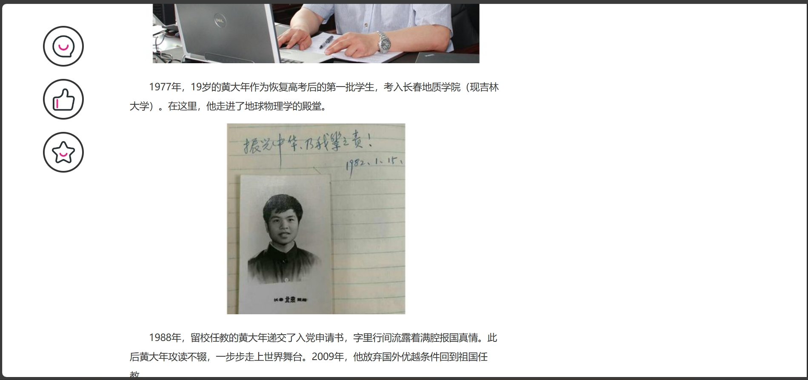

# INews网页前端

## 首页

网页文件为**root.html**，展示效果如图

首页最上方为标题，下方为具体新闻。点击新闻标题可实现详情页跳转（**今日推荐**部分（右侧）除最后一条新闻外尚未链接，最后一条新闻链接至今日头条网站）

其css文件位于**css/root.css**路径下

## 新闻详情页

网页文件为**index.html**，展示效果如图

其中新闻内容左侧（评论、点赞、收藏部分）下滑可实现固定效果（js实现），效果如下

其css文件位于**css/index.css**路径下